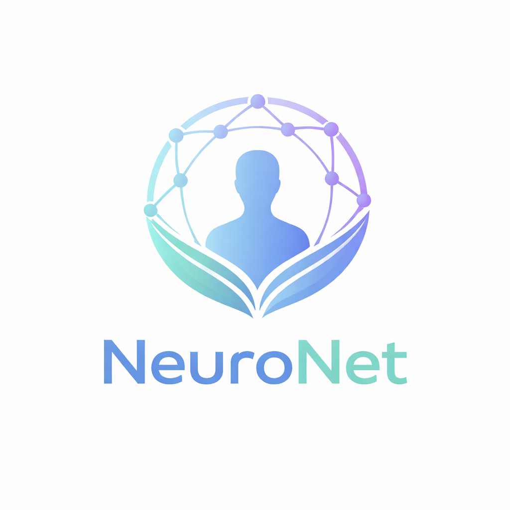

<p align="center">
  
</p>

<h1 align="center">🧠 NeuroNet — AI-Powered Mental Wellness Ecosystem</h1>

<p align="center">
  <em>Mental Wellness, Reimagined for Real Life.</em>
</p>

<p align="center">
  <strong>A full-stack mental health platform that combines AI companionship, peer support, professional therapy, and gamified engagement — designed for individuals across the entire severity spectrum, from everyday stress to clinical-level crisis.</strong>
</p>

<p align="center">
  
  
  
  
  
  
  
  
</p>

---

## 📑 Table of Contents

- [🌟 Vision & Problem Statement](#-vision--problem-statement)
- [🏗️ Architecture Overview](#️-architecture-overview)
- [🛠️ Tech Stack](#️-tech-stack)
- [✨ Features — Complete Breakdown](#-features--complete-breakdown)
  - [1. Landing Page & Bilingual UI](#1-landing-page--bilingual-ui)
  - [2. Authentication & Role-Based Access Control](#2-authentication--role-based-access-control)
  - [3. AI Companion Chat (Gemini-Powered)](#3-ai-companion-chat-gemini-powered)
  - [4. Real-Time Crisis Detection & Intervention](#4-real-time-crisis-detection--intervention)
  - [5. Live Insight Engine (Emotional Analytics)](#5-live-insight-engine-emotional-analytics)
  - [6. Session Summarization](#6-session-summarization)
  - [7. NeuroPet — 3D Interactive Companion](#7-neuropet--3d-interactive-companion)
  - [8. Adaptive Video Coaching (AVC)](#8-adaptive-video-coaching-avc)
  - [9. Clinical Self-Assessments (PHQ-9 & GAD-7)](#9-clinical-self-assessments-phq-9--gad-7)
  - [10. Smart User Profiling System](#10-smart-user-profiling-system)
  - [11. Doctor Discovery & Appointment Booking](#11-doctor-discovery--appointment-booking)
  - [12. Community Support Groups (Firebase-Powered)](#12-community-support-groups-firebase-powered)
  - [13. Therapist Portal](#13-therapist-portal)
  - [14. Buddy System (Peer Support)](#14-buddy-system-peer-support)
  - [15. Personalized YouTube Content Feed](#15-personalized-youtube-content-feed)
  - [16. Offline Mode & PWA-Ready Tools](#16-offline-mode--pwa-ready-tools)
  - [17. User Dashboard](#17-user-dashboard)
  - [18. Interest-Based Trivia Engine](#18-interest-based-trivia-engine)
  - [19. Multilingual Support (i18n)](#19-multilingual-support-i18n)
  - [20. Dark/Light Theme System](#20-darklight-theme-system)
- [📁 Project Structure](#-project-structure)
- [🗄️ Database Schema](#️-database-schema)
- [🔌 API Routes](#-api-routes)
- [⚙️ Environment Configuration](#️-environment-configuration)
- [🚀 Getting Started](#-getting-started)
- [📊 Business Model](#-business-model)
- [🔧 Required Modifications & Enhancements to Win](#-required-modifications--enhancements-to-win)

---

## 🌟 Vision & Problem Statement

### The Problem
India has **200 million+ people** suffering from mental health conditions, yet less than **20%** receive any care. The barriers are:
- **Stigma** — People avoid seeking help due to social judgment
- **Accessibility** — Licensed therapists are concentrated in metros; rural areas have near-zero access
- **Affordability** — Therapy costs ₹1,500–₹5,000/session, unaffordable for most
- **Awareness** — Most people can't identify mental health symptoms early
- **Fragmentation** — Chat apps, therapy platforms, and community support exist in silos

### The NeuroNet Solution
NeuroNet is a **single, unified platform** that caters to individuals across the **entire mental health severity spectrum**:

| Severity Level | NeuroNet Feature |
|---|---|
| **No concerns** — Wellness maintenance | NeuroPet, Trivia, YouTube Feed, Breathing exercises |
| **Mild** — Everyday stress, low mood | AI Companion Chat, Mood Tracking, Journaling, Offline Tools |
| **Moderate** — Persistent anxiety/depression | Self-Assessments (PHQ-9/GAD-7), Community Groups, Buddy System |
| **High** — Clinical-level symptoms | Doctor Discovery, Appointment Booking, Therapist Video Sessions |
| **Crisis** — Suicidal ideation, self-harm | Real-Time Crisis Detection, Auto-Redirect to Calming Content, Emergency Contacts |

---

## 🏗️ Architecture Overview

```
┌─────────────────────────────────────────────────────────────────────┐
│                          FRONTEND (Next.js 16 + React 19)          │
│  ┌─────────┐ ┌──────────┐ ┌──────────┐ ┌──────────┐ ┌───────────┐ │
│  │ Landing  │ │Dashboard │ │ Chat AI  │ │ NeuroPet │ │Therapist  │ │
│  │  Page    │ │  (User)  │ │Companion │ │  3D Pet  │ │  Portal   │ │
│  └─────────┘ └──────────┘ └──────────┘ └──────────┘ └───────────┘ │
│  ┌──────────┐ ┌──────────┐ ┌──────────┐ ┌──────────┐              │
│  │Assessment│ │  Groups  │ │  Buddy   │ │   AVC    │              │
│  │(PHQ/GAD) │ │(Firebase)│ │  System  │ │ Coaching │              │
│  └──────────┘ └──────────┘ └──────────┘ └──────────┘              │
├─────────────────────────────────────────────────────────────────────┤
│                         MIDDLEWARE (JWT + RBAC)                     │
│            Role Guards: User | Therapist | Buddy                    │
├─────────────────────────────────────────────────────────────────────┤
│                          API LAYER (Next.js Route Handlers)         │
│  /api/chat  /api/auth  /api/profile  /api/appointments             │
│  /api/neuropet/chat  /api/avc/session  /api/youtube/feed           │
│  /api/therapist/onboarding  /api/doctors  /api/seed                │
├──────────────────────────┬──────────────────────────────────────────┤
│     AI / ML ENGINE       │           DATA LAYER                     │
│  ┌─────────────────┐     │  ┌─────────────┐  ┌──────────────┐      │
│  │  Google Gemini   │     │  │  NeonDB     │  │  Firebase    │      │
│  │  (Chat + Insight │     │  │  (Postgres) │  │  (Firestore) │      │
│  │   + Summarize)   │     │  │  Drizzle ORM│  │  Groups/Chat │      │
│  └─────────────────┘     │  └─────────────┘  └──────────────┘      │
│  ┌─────────────────┐     │  ┌──────────────────────────────┐       │
│  │  MediaPipe       │     │  │  Zustand (Client State)      │       │
│  │  (Face Detection)│     │  │  Local Storage (Offline)     │       │
│  └─────────────────┘     │  └──────────────────────────────┘       │
├──────────────────────────┴──────────────────────────────────────────┤
│                     CRISIS DETECTION PIPELINE                       │
│  User Message → Keyword Scan (EN/HI) → Risk Assessment             │
│                → High Risk? → Supportive Alert → Auto-Redirect      │
└─────────────────────────────────────────────────────────────────────┘
```

---

## 🛠️ Tech Stack

| Category | Technology | Purpose |
|---|---|---|
| **Framework** | Next.js 16.1 (App Router) | Full-stack React with SSR, API routes, middleware |
| **UI Library** | React 19.2 | Component rendering |
| **Language** | TypeScript 5 | Type safety across the codebase |
| **Styling** | Tailwind CSS 4 + Radix UI | Utility-first CSS + Accessible component primitives |
| **AI Engine** | Google Gemini (`@google/genai`) | AI chat companion, insight engine, summarization |
| **Database** | NeonDB (Serverless Postgres) | Users, profiles, sessions, messages, assessments |
| **ORM** | Drizzle ORM | Type-safe SQL queries |
| **Realtime DB** | Firebase Firestore | Community groups, member management, real-time chat |
| **Authentication** | Custom JWT (jose + bcryptjs) | Secure token-based auth with HTTP-only cookies |
| **3D Rendering** | Three.js + React Three Fiber + Drei | Interactive 3D NeuroPet companion |
| **Face Detection** | MediaPipe (Google) | Real-time face tracking in AVC coaching |
| **Speech** | Web Speech API (SpeechRecognition + SpeechSynthesis) | Voice input in chat, NeuroPet conversations, AVC analysis |
| **Animations** | Framer Motion | Page transitions and micro-interactions |
| **Charts** | Recharts | Mood charts, therapist analytics |
| **State Management** | Zustand | Client-side state (NeuroPet progression) |
| **Notifications** | Sonner | Toast-based notification system |
| **Date Utilities** | date-fns | Date formatting and manipulation |
| **Font** | Poppins (Google Fonts) | Clean, modern typography across all pages |

---

## ✨ Features — Complete Breakdown

### 1. Landing Page & Bilingual UI
**Files:** `app/page.tsx`

A fully responsive, beautifully designed landing page that serves as the public face of NeuroNet.

- **Bilingual Toggle** — Seamless switch between **English** and **Hindi** for every section
- **Dark/Light Mode** — Custom color schemes for both themes (Teal-dark, Warm-light palette)
- **Sections:** Hero, Why NeuroNet, How It Works, For Therapists & Buddies, NGO Partnerships, Business Model, About, Footer
- **Responsive Navbar** with mobile hamburger menu
- **Trust Indicators** — "Privacy-first", "India-focused care", "AI + Human-in-the-loop"
- **NeuroPet CTA** — Direct link to the 3D pet companion from the hero section

---

### 2. Authentication & Role-Based Access Control
**Files:** `app/auth/login/page.tsx`, `app/auth/register/page.tsx`, `app/api/auth/login/route.ts`, `app/api/auth/register/route.ts`, `app/api/auth/me/route.ts`, `middleware.ts`, `lib/auth.ts`

A complete authentication system with three distinct user roles.

- **Roles:** `user`, `therapist`, `buddy` — each with their own protected dashboard
- **JWT Authentication** — Tokens issued on login, stored in HTTP-only cookies
- **Password Security** — Passwords hashed with `bcryptjs`
- **Middleware Guard** — Every protected route passes through `middleware.ts` which:
  - Validates JWT tokens using the `jose` library
  - Enforces strict role separation (therapists can't access user routes and vice versa)
  - Redirects unauthenticated users to `/auth/login`
  - Forces therapists to complete onboarding before accessing their dashboard
  - Automatically redirects root role paths (`/therapist` → `/therapist/dashboard`)
- **Role-Based Routing:**
  - Users → `/dashboard`
  - Therapists → `/therapist/dashboard`
  - Buddies → `/buddy/dashboard`

---

### 3. AI Companion Chat (Gemini-Powered)
**Files:** `app/chat-ai/page.tsx`, `app/api/chat/route.ts`, `lib/gemini/client.ts`, `lib/gemini/prompts.ts`, `lib/gemini/context.ts`, `components/chat/VoiceChatInput.tsx`

The core therapeutic conversation engine of NeuroNet.

- **Psychiatrist-Style AI** — System prompts configured to emulate an experienced mental health professional
- **Bilingual Responses** — Separate system prompts for English and Hindi (`COMPANION_PROMPTS`)
- **Voice Input** — Speech-to-text via Web Speech API (`useSpeechToText` hook) with a dedicated `VoiceChatInput` component
- **Session Management** — Each conversation creates a persistent `aiChatSessions` record in the database
- **Message Persistence** — All user and AI messages stored in `aiChatMessages` table
- **Context Window Optimization** — Only the last 5 messages are sent to Gemini to reduce latency (`SLIM_HISTORY_LIMIT`)
- **Offline Fallback** — When the user is offline, responses are served from a pre-built keyword-matched dataset (`lib/offline-support.ts`)
- **Status Indicators** — Visual states: "Listening", "Thinking", "Idle" with animated pulse dots
- **Typing Animation** — Bouncing dot loader while AI processes the response
- **Background Job Architecture** — Database writes and insight generation are **fire-and-forget** to minimize response latency
- **Emotion Badges** — Each AI message can display an emotion tag
- **Telemetry** — Built-in latency monitoring for all API operations (`[LATENCY]` logs)

**Strict AI Safety Rules:**
- No medical diagnoses
- No medication prescriptions
- Not a substitute for real professionals
- No generated percentages or scores

---

### 4. Real-Time Crisis Detection & Intervention
**Files:** `lib/crisis.ts`, `data/crisis_keywords.json`, `app/chat-ai/page.tsx`

A critical safety system that detects suicidal ideation and self-harm in real-time.

- **Multilingual Keyword Database** — Crisis keywords in both **English and Hindi**, covering:
  - `high_risk`: "suicide", "kill myself", "self harm", "आत्महत्या", "मर जाना चाहता हूँ" (18+ phrases)
  - `moderate_risk`: "hopeless", "nothing matters", "बहुत निराश", "टूट सा गया हूँ" (12+ phrases)
  - Includes **common typos/misspellings** (e.g., "sucide", "suicde")
- **Risk-Level Classification:**
  - `high` — 1+ strong keyword match OR 2+ moderate matches
  - `moderate` — 1 moderate match
  - `low` — No matches
- **On High Risk:**
  1. Full-screen **supportive message overlay** with calming language
  2. A **6-second countdown** with a visual progress bar
  3. **Auto-redirect** to the YouTube feed page with curated calming content
  4. The YouTube feed page shows a **"Book a Therapist Session"** panel at the bottom
- **Cross-Language Scanning** — Scans against ALL language keywords regardless of user's set language for maximum safety
- **Non-Alarming UX** — Message is warm and supportive: *"What you're feeling right now is serious, and it matters. Hurting yourself is not the solution — support is available."*

---

### 5. Live Insight Engine (Emotional Analytics)
**Files:** `lib/gemini/prompts.ts` (`INSIGHT_ENGINE_PROMPT`), `app/api/chat/route.ts`, `config/schema.ts` (`aiChatInsights`)

A separate AI engine that runs in the background during conversations.

- **Runs on Every Exchange** — After each user-AI message pair, a secondary Gemini call analyzes emotional state
- **Outputs:**
  - `topic` — Current conversation topic (e.g., "Work Stress", "Relationships")
  - `calmness` — 0-100% score (increases for reflective/calm messages)
  - `openness` — 0-100% score (increases when user shares details)
  - `suggestion` — One actionable suggestion related to the topic
- **Smoothing Rule** — Maximum ±10% change per update to prevent jarring jumps
- **Live Sidebar Panel** — Results displayed in a collapsible right panel with animated progress bars
- **Multilingual Output** — Insights generated in the session's language
- **Database Persistence** — All insights stored in `aiChatInsights` table for therapist review

---

### 6. Session Summarization
**Files:** `lib/gemini/prompts.ts` (`SUMMARIZATION_PROMPT`), `app/api/chat/summarize/route.ts`

- **On-Demand Summaries** — Users can request a bullet-point summary of any chat session
- **4-6 Bullet Points** — Captures main topics, emotional patterns, and coping strategies mentioned
- **Bilingual** — Summaries generated in session language (EN/HI)
- **Safety Filtered** — No diagnoses, medication suggestions, or judgmental language
- **Use Cases:** User self-reflection, therapist pre-briefing (with consent)

---

### 7. NeuroPet — 3D Interactive Companion
**Files:** `app/neuropet/page.tsx`, `components/neuropet/*`, `lib/neuropet/*`, `public/neuropet/*`

A fully interactive 3D virtual pet that grows based on user engagement — the **gamification heart** of NeuroNet.

- **3D Model** — Rendered with Three.js + React Three Fiber in a cinematic scene
- **Interactive Animations** — Multiple pet animations (Dance, Wave, Happy, Love, Clap, Sad, Idle, etc.) triggered by action buttons
- **XP & Leveling System** — Zustand-powered progression with:
  - Progressive XP curve: `XP = BASE × Level^1.4`
  - 8 Growth Stages: Hatchling → Baby → Juvenile → Teen → Adult → Elder → Mythic → **Legendary (Level 50)**
  - Level 50 Reward: BMW M4 3D model showcase (`RewardShowcase` component)
  - Negative actions (Sad, Angry, Scared) **decrease** XP
- **Voice Conversation System** — Talk to your pet using voice:
  - **Flow:** Mic → SpeechRecognition → Gemini API (`/api/neuropet/chat`) → SpeechSynthesis
  - Pet responds with a **soft, friendly voice** (prefers Google UK English Female, Microsoft Zira, Samantha)
  - Live transcript appears in a floating speech bubble
  - Pet plays matching animation based on detected emotion
- **Emoji Reactions** — Burst of themed emojis on every interaction
- **Sound Effects** — Landing sound, background ambient voice, action-specific sound effects
- **Cinematic Scene** — Custom lighting, ground plane, sky dome, particles (`SceneEnvironment`)
- **Progress HUD** — Level bar, XP tracker, growth stage display, action buttons
- **Orbit Controls** — Users can rotate/zoom the 3D scene

---

### 8. Adaptive Video Coaching (AVC)
**Files:** `app/avc/page.tsx`, `app/avc/practice/*/page.tsx`, `app/avc/report/*/page.tsx`, `lib/avc/scenarios.ts`, `lib/avc/analysis.ts`, `app/api/avc/session/route.ts`

A video-based coaching system that helps users practice social interactions with AI feedback.

- **Scenarios:**
  - ☕ **Ordering Coffee** (Social Anxiety, Beginner) — Practice eye contact and clear speech
  - 💼 **Tell Me About Yourself** (Interview Prep, Intermediate) — 60-second professional summary
  - 🎤 **30-Second Pitch** (Public Speaking, Advanced) — High-energy delivery practice
- **Real-Time Analysis (During Recording):**
  - **Speech Analysis** — Word count, words-per-minute, filler word detection ("um", "uh", "like", "you know" + Hindi/Marathi fillers)
  - **Silence/Pause Detection** — Web Audio API analyzes microphone volume; pauses >1.5s counted
  - **Face Detection** — Google MediaPipe BlazeFace model tracks face visibility percentage in real-time
  - **Face Status** — "Face Detected" vs "Face Not Visible — Center Yourself"
- **Post-Session Report** — AI-generated feedback via `/api/avc/session` route
- **Webcam Integration** — Uses `react-webcam` for live video capture

---

### 9. Clinical Self-Assessments (PHQ-9 & GAD-7)
**Files:** `app/assessment/page.tsx`, `app/assessment/layout.tsx`, `components/assessment/Disclaimer.tsx`

Clinically-backed screening tools for depression and anxiety.

- **PHQ-9 (Depression)** — 9 validated questions on the Patient Health Questionnaire
- **GAD-7 (Anxiety)** — 7-item scale for generalized anxiety disorder
- **Scoring System:**
  - 4 Likert-scale options per question (0-3)
  - Instant score calculation with severity classification
  - Result categories: Minimal → Mild → Moderate → Moderately Severe → Severe
- **Results Page:**
  - Total score display with risk-level badge
  - Color-coded severity indicator (green → red)
  - Personalized interpretation and advice
  - Direct link to "Book Consultation" for moderate+ results
- **Medical Disclaimer** — Visible disclaimer component stating assessments are not diagnoses
- **Smooth UX** — Progress bar, animated transitions, step-by-step flow

---

### 10. Smart User Profiling System
**Files:** `app/profile/page.tsx`, `app/api/profile/route.ts`, `components/profile/InterviewField.tsx`

A comprehensive profiling system that understands users holistically — not just their mental health.

- **Core Details:** Gender, Preferred Language, Primary Concern, Therapy Preference, Previous Experience, Sleep Pattern, Support System, Stress Level
- **Social Media Interests:** YouTube, Instagram, Twitter(X), Reddit — with follow-up questions per platform
- **Hobbies:** Standard checklist + free-text "Other" option
- **Music Details:** Genre selection (10 options) + favorite artist
- **Entertainment:** Binge category (Movies/Series/Anime/Comics), Top 3 favorites list, Comfort Artist, Favorite Comedian
- **Voice Input Support** — Each field can optionally accept voice input with language auto-detection
- **Input Metadata Tracking** — Records whether each field was filled via typing or voice, and in which language
- **Autofill Feature** — One-click demo profile population for hackathon presentations
- **Localized Options** — All dropdowns available in English, Hindi, and Marathi
- **Why This Matters:** Profile data powers personalized YouTube feed, trivia cards, buddy matching, and AI context

---

### 11. Doctor Discovery & Appointment Booking
**Files:** `app/doctors/page.tsx`, `app/appointments/page.tsx`, `app/appointments/book/*/page.tsx`, `app/api/appointments/route.ts`, `app/api/appointments/create/route.ts`, `app/api/doctors/route.ts`, `data/doctors.ts`, `components/doctors/DoctorCard.tsx`, `context/AppointmentContext.tsx`

Full-featured doctor browsing and appointment management system.

- **Doctor Cards** — Display name, specialization, image, and booking CTA
- **Appointment Management:**
  - Tabs: Upcoming | Past | Find Therapist
  - Calendar widget for date selection
  - Appointment cards with date box, therapist name, session type, time, duration
  - Status badges: Scheduled, Completed, Cancelled
  - Join button for upcoming video sessions
- **Database-Backed:**
  - `appointments` table with doctor snapshot (immutable record at booking time)
  - Session type, price, status tracking
- **Crisis Support Widget** — "Need Immediate Help?" card with crisis helpline button
- **Empty State** — Graceful handling when no appointments exist

---

### 12. Community Support Groups (Firebase-Powered)
**Files:** `app/groups/page.tsx`, `app/groups/[id]/page.tsx`, `lib/firebase.ts`

Real-time community support groups built on Firebase Firestore.

- **Pre-Built Groups:**
  - Anxiety Warriors, Mindful Living, Depression Support, Social Confidence, Sleep & Insomnia, Work Stress
- **Features:**
  - Real-time member counts
  - "Safe Space" moderated badge
  - Community rules modal before joining
  - Join/Leave with Firestore document management
  - Per-group real-time chat (`groups/{id}` dynamic route)
  - Membership tracking via `members` subcollection
- **Bilingual Group Names & Descriptions** — English and Hindi versions for all groups
- **Search** — Filter groups by name

---

### 13. Therapist Portal
**Files:** `app/therapist/*`, `components/therapist-sidebar.tsx`, `app/api/therapist/onboarding/route.ts`

A complete professional dashboard for verified therapists.

- **Onboarding Flow:**
  - Full Name, Mobile Number, License Number
  - Specialization checkboxes (Anxiety, Depression, Stress, Trauma, Relationships, Career, Adolescents)
  - Per-session fee (INR), Preferred session type (Video/Audio/Both)
  - JWT token refresh after onboarding completion
- **Therapist Dashboard:**
  - Stats: Total Patients (129), Sessions This Week (35), Avg Rating (4.8), Urgent Alerts (2)
  - Today's Appointment Queue with risk-level badges (High Risk flagged in red)
  - Weekly session analytics bar chart (Recharts)
  - **AI Urgent Case Alerts** — Cards showing "Severe Mood Drop" or "Crisis Keywords Detected" with Review buttons
  - **AI Pre-Briefing** — Sentiment trend summary before next session (e.g., "15% increase in positive sentiment... sleep patterns irregular")
- **Sub-Pages:** Patients listing, Individual patient view (`/patients/[id]`), Schedule management, Video sessions, Therapist profile

---

### 14. Buddy System (Peer Support)
**Files:** `app/buddy/*`, `components/buddy-sidebar.tsx`

A social-media-inspired peer support system for trained buddies.

- **Buddy Dashboard:**
  - Instagram-style stories/highlights (XP earned, badges, streaks)
  - Stats: Sessions (24), Rating (4.9), XP Earned (1.2k)
  - Recent Messages feed with mood indicators (Happy/Neutral/Calm)
  - Unread message badges
  - **Buddy Request Queue** — Match requests with interest tags and compatibility score (e.g., "92% Match")
  - Accept/Decline buttons
  - **Peer Support Tips** — Daily tip card with gradient design
  - Training module link
- **Sub-Pages:** Chat, Connections (with individual view), Buddy Profile, Match Requests, Session History, Training

---

### 15. Personalized YouTube Content Feed
**Files:** `app/youtube-feed/page.tsx`, `app/utubefeed/page.tsx`, `components/dashboard/YoutubeFeed.tsx`, `app/api/youtube/feed/route.ts`

Auto-curated mental wellness video content from YouTube.

- **YouTube Data API Integration** — Fetches wellness-related videos dynamically
- **Dual Purpose:**
  1. **Dashboard Widget** — Shows personalized content on the user dashboard
  2. **Crisis Redirect Destination** — When crisis is detected, users are redirected here for calming content
- **Therapist Booking Panel** — A fixed bottom panel offering to book a session: *"If you're ready to talk, professional support is just a click away."*
- **Bilingual UI** — Labels in English and Hindi

---

### 16. Offline Mode & PWA-Ready Tools
**Files:** `app/offline/*`, `context/OfflineContext.tsx`, `components/offline-landing.tsx`, `components/app-sidebar.tsx`, `lib/offline-support.ts`, `data/offline-dataset.ts`

NeuroNet continues to work **without internet** via a comprehensive offline toolkit.

- **Offline Detection** — Automatic via `navigator.onLine` + manual toggle in sidebar
- **Online/Offline Toggle** — Tab switch in sidebar with visual state changes
- **Feature Locking** — Online-only features (AI Chat, Assessment, Groups, Appointments) are greyed out with lock icons
- **Offline Tools Available:**
  - 🌬️ **Breathing Exercises** (`/offline/breathing`) — Guided breathing patterns
  - 📊 **Mood Logger** (`/offline/mood`) — Track emotions locally
  - 🎮 **Calming Games** (`/offline/games`) — Distraction-based activities
  - 📝 **Journaling** (`/offline/journal`) — Private journaling with localStorage
  - 💡 **Wellness Tips** (`/offline/tips`) — Pre-loaded mental health tips
  - 📞 **Emergency Help** (`/offline/help`) — Crisis helpline numbers (no internet needed)
- **Offline AI Chat** — When offline, chat returns keyword-matched responses from a pre-built dataset (`offline-dataset.ts` with 22KB of multilingual responses)
- **Data Sync** — Mock sync mechanism re-uploads journal entries and mood logs when back online
- **Offline Landing Page** — Clean UI explaining available tools when dashboard detects offline state

---

### 17. User Dashboard
**Files:** `app/dashboard/page.tsx`, `app/dashboard/layout.tsx`, `components/dashboard/*`

The central hub for users after login.

- **Components:**
  - **Mood Chart** — Visual mood tracking over time
  - **Streak Card** — Engagement streak counter
  - **Quick Actions** — Shortcuts to AI Chat, Assessment, Appointments
  - **Upcoming Appointments** — Next scheduled sessions
  - **Progress Indicators** — Wellness progress metrics
  - **YouTube Feed** — Personalized content section
- **Search Bar** — Integrated search with icon
- **Header Controls** — Notifications, Language Toggle, Theme Toggle, User Avatar
- **Sidebar Navigation** — Full `AppSidebar` with:
  - Main menu (Dashboard, AI Companion, NeuroPet, Assessment, Groups, AVC, Appointments, Settings)
  - Offline tools section
  - Profile link in footer
  - Collapsible with icon-only compact mode

---

### 18. Interest-Based Trivia Engine
**Files:** `lib/trivia.ts`, `components/trivia-card.tsx`

A smart system that delivers daily personalized mental wellness facts.

- **Interest Extraction** — Parses user profile text to identify categories: Comedy, Music, Movies, Series, Sports, Nature, Science, General
- **Pre-Translated Trivia** — Each fact available in English, Hindi, and Marathi
- **Deterministic Rotation** — Same trivia shown all day (day-of-year modulo pool size)
- **Sample Facts:**
  - *"Listening to music can initiate the release of dopamine, the 'feel-good' neurotransmitter."*
  - *"A good hearty laugh relieves physical tension, leaving muscles relaxed for 45 minutes."*
  - *"Spending just 20 minutes in nature significantly lowers cortisol levels."*

---

### 19. Multilingual Support (i18n)
**Files:** `context/LanguageContext.tsx`, `data/translations.ts`, `components/language-toggle.tsx`, `app/settings/page.tsx`

- **Languages:** English (`en`), Hindi (`hi`), Marathi (`mr`)
- **Coverage:** 29KB translation file covering all UI strings, greetings, navigation, chat messages, offline labels, assessment text
- **Implementation:** React Context + `t()` translation function
- **Settings Page** — Visual language picker with character preview (A, अ, म)
- **Landing Page** — Standalone bilingual system (EN/HI toggle)
- **Per-Component Localization** — Groups, YouTube Feed, Crisis Alerts, Profile dropdowns all have localized variants

---

### 20. Dark/Light Theme System
**Files:** `components/theme-provider.tsx`, `components/mode-toggle.tsx`, `app/globals.css`

- **System-Aware Default** — Automatically matches OS theme preference
- **Manual Toggle** — Sun/Moon icon toggle available on every page
- **Powered by `next-themes`** — Seamless SSR-compatible theming
- **Custom Landing Theme** — Landing page uses its own bespoke color palette (teal/warm) independent of the app theme

---

## 📁 Project Structure

```
NN2.0/
├── app/
│   ├── api/                          # Next.js API Route Handlers
│   │   ├── appointments/             # CRUD for appointments
│   │   ├── auth/                     # Login, Register, Me
│   │   ├── avc/session/              # AVC coaching AI feedback
│   │   ├── chat/                     # AI chat + summarization
│   │   ├── doctors/                  # Doctor listing
│   │   ├── neuropet/chat/            # NeuroPet voice chat AI
│   │   ├── profile/                  # User profile CRUD
│   │   ├── seed/                     # Database seeding
│   │   ├── therapist/onboarding/     # Therapist profile setup
│   │   └── youtube/feed/             # YouTube API integration
│   ├── appointments/                 # Appointment management pages
│   ├── assessment/                   # PHQ-9 & GAD-7 self-assessments
│   ├── auth/                         # Login & Register pages
│   ├── avc/                          # Adaptive Video Coaching
│   │   ├── practice/                 # Recording sessions
│   │   └── report/                   # Post-session reports
│   ├── buddy/                        # Buddy system portal
│   │   ├── chat/                     # Buddy messaging
│   │   ├── connections/              # Connection management
│   │   ├── dashboard/                # Buddy dashboard
│   │   ├── profile/                  # Buddy profile
│   │   ├── requests/                 # Match requests
│   │   ├── sessions/                 # Session history
│   │   └── training/                 # Training modules
│   ├── chat-ai/                      # AI Companion chat page
│   ├── dashboard/                    # User dashboard
│   ├── doctors/                      # Doctor discovery
│   ├── groups/                       # Community support groups
│   │   └── [id]/                     # Individual group chat
│   ├── neuropet/                     # 3D NeuroPet page
│   ├── offline/                      # Offline wellness tools
│   │   ├── breathing/                # Breathing exercises
│   │   ├── games/                    # Calming games
│   │   ├── help/                     # Emergency contacts
│   │   ├── journal/                  # Private journaling
│   │   ├── mood/                     # Mood logger
│   │   └── tips/                     # Wellness tips
│   ├── profile/                      # User profile editor
│   ├── settings/                     # Language settings
│   ├── therapist/                    # Therapist portal
│   │   ├── dashboard/                # Therapist dashboard
│   │   ├── onboarding/               # Professional setup
│   │   ├── patients/                 # Patient management
│   │   ├── profile/                  # Therapist profile
│   │   ├── schedule/                 # Schedule management
│   │   └── video-sessions/           # Video session interface
│   ├── youtube-feed/                 # Curated content page
│   ├── globals.css                   # Global styles
│   ├── layout.tsx                    # Root layout with providers
│   └── page.tsx                      # Landing page
├── components/
│   ├── assessment/                   # Assessment components
│   ├── chat/                         # Chat input components
│   ├── dashboard/                    # Dashboard widgets
│   ├── doctors/                      # Doctor card components
│   ├── neuropet/                     # NeuroPet components (9 files)
│   ├── profile/                      # Profile editor components
│   ├── ui/                           # shadcn/ui component library (25+ files)
│   ├── app-sidebar.tsx               # Main user sidebar navigation
│   ├── buddy-sidebar.tsx             # Buddy sidebar navigation
│   ├── therapist-sidebar.tsx         # Therapist sidebar navigation
│   ├── DoctorModel.tsx               # 3D doctor model
│   ├── language-toggle.tsx           # Language switcher
│   ├── mode-toggle.tsx               # Theme toggle
│   ├── offline-landing.tsx           # Offline state UI
│   ├── theme-provider.tsx            # Theme context
│   └── trivia-card.tsx               # Daily trivia widget
├── config/
│   ├── db.ts                         # NeonDB + Drizzle connection
│   └── schema.ts                     # Complete database schema
├── context/
│   ├── AppointmentContext.tsx         # Appointment state
│   ├── LanguageContext.tsx            # i18n context
│   └── OfflineContext.tsx             # Offline detection context
├── data/
│   ├── crisis_keywords.json          # Crisis detection keywords (EN/HI)
│   ├── doctors.ts                    # Doctor profiles data
│   ├── offline-dataset.ts            # 22KB offline response dataset
│   └── translations.ts              # 29KB translation strings
├── hooks/
│   ├── use-mobile.ts                 # Mobile detection hook
│   └── useSpeechToText.ts            # Speech recognition hook
├── lib/
│   ├── avc/                          # AVC coaching logic
│   │   ├── ai-service.ts             # AI feedback service
│   │   ├── analysis.ts               # Speech + Face analysis hooks
│   │   └── scenarios.ts              # Practice scenario definitions
│   ├── gemini/                       # Gemini AI integration
│   │   ├── client.ts                 # Gemini model client
│   │   ├── context.ts                # Chat context builder
│   │   └── prompts.ts                # All AI system prompts
│   ├── neuropet/                     # NeuroPet logic
│   │   ├── data/emotionMap.ts        # Animation → Emotion mapping
│   │   └── store/
│   │       ├── petStore.ts           # XP, leveling, growth stages (Zustand)
│   │       └── voiceStore.ts         # Voice conversation state
│   ├── speech/                       # Speech engine wrappers
│   │   ├── browserEngine.ts          # Browser speech API
│   │   └── speechEngine.ts           # Abstract speech engine
│   ├── auth.ts                       # Auth utility functions
│   ├── crisis.ts                     # Crisis detection algorithm
│   ├── firebase.ts                   # Firebase config
│   ├── offline-support.ts            # Offline response matcher
│   ├── trivia.ts                     # Interest-based trivia engine
│   └── utils.ts                      # General utilities
├── public/
│   ├── models/                       # 3D model files (GLB/GLTF)
│   ├── neuropet/                     # NeuroPet assets (voices, images)
│   ├── nn.png                        # NeuroNet logo
│   └── thp*.jpg                      # Therapist profile images
├── scripts/
│   └── seed.ts                       # Database seeding script
├── types/
│   └── speech-recognition.d.ts       # TypeScript type declarations
├── middleware.ts                      # JWT + RBAC middleware
├── drizzle.config.ts                  # Drizzle ORM configuration
├── package.json                       # Dependencies & scripts
├── tsconfig.json                      # TypeScript configuration
└── next.config.ts                     # Next.js configuration
```

---

## 🗄️ Database Schema

Built on **NeonDB (Serverless Postgres)** using **Drizzle ORM**.

```
┌─────────────────┐     ┌─────────────────────┐     ┌──────────────────────┐
│     users        │     │  therapist_profiles  │     │    user_profiles     │
├─────────────────┤     ├─────────────────────┤     ├──────────────────────┤
│ id (UUID, PK)   │◄────│ userId (FK)         │     │ userId (VARCHAR)     │
│ email           │     │ fullName            │     │ gender               │
│ passwordHash    │     │ mobileNumber        │     │ preferredLanguage    │
│ role            │     │ licenseNumber       │     │ primaryConcern       │
│ isOnboarding    │     │ specializations[]   │     │ therapyPreference    │
│   Complete      │     │ perSessionFee       │     │ previousExperience   │
│ createdAt       │     │ preferredSession    │     │ sleepPattern         │
└─────────────────┘     │   Type              │     │ supportSystem        │
                        │ isVerified          │     │ stressLevel          │
                        └─────────────────────┘     │ socialPlatforms[]    │
                                                    │ socialPreferences{}  │
┌─────────────────┐                                 │ hobbies[]           │
│     doctors      │                                 │ musicDetails{}      │
├─────────────────┤     ┌─────────────────────┐     │ entertainment{}     │
│ doctorId (PK)   │     │    appointments      │     │ inputMetadata{}     │
│ doctorData{}    │     ├─────────────────────┤     └──────────────────────┘
│ isActive        │     │ appointmentId (PK)  │
│ createdAt       │     │ userId              │
└─────────────────┘     │ doctorId            │
                        │ doctorSnapshot{}    │     ┌──────────────────────┐
                        │ appointmentDate     │     │  ai_chat_sessions    │
                        │ appointmentTime     │     ├──────────────────────┤
                        │ sessionType         │     │ sessionId (PK)      │
                        │ price               │     │ userId              │
                        │ status              │     │ language            │
                        └─────────────────────┘     │ startedAt / endedAt │
                                                    │ summary             │
┌─────────────────────┐                             └──────────────────────┘
│  ai_chat_messages    │                                       │
├─────────────────────┤                                        │
│ messageId (PK)      │     ┌──────────────────────┐          │
│ sessionId (FK) ─────│─────│  ai_chat_insights    │──────────┘
│ sender (user|ai)    │     ├──────────────────────┤
│ messageText         │     │ insightId (PK)       │
│ createdAt           │     │ sessionId (FK)       │
└─────────────────────┘     │ currentTopic         │
                            │ emotionalTone{}      │
                            │ suggestionText       │
                            │ language             │
                            └──────────────────────┘
```

---

## 🔌 API Routes

| Endpoint | Method | Description |
|---|---|---|
| `/api/auth/register` | POST | Register new user (user/therapist/buddy) |
| `/api/auth/login` | POST | Login, returns JWT + sets HTTP-only cookie |
| `/api/auth/me` | GET | Get current authenticated user |
| `/api/chat` | POST | AI companion chat (Gemini + crisis detection + insights) |
| `/api/chat/summarize` | POST | Generate session summary |
| `/api/profile` | GET/POST | Read/write user profile |
| `/api/doctors` | GET | List all doctors |
| `/api/appointments` | GET | List user's appointments |
| `/api/appointments/create` | POST | Book new appointment |
| `/api/neuropet/chat` | POST | NeuroPet voice conversation (Gemini) |
| `/api/avc/session` | POST | AVC coaching session AI feedback |
| `/api/therapist/onboarding` | POST | Complete therapist profile |
| `/api/youtube/feed` | GET | Fetch YouTube wellness content |
| `/api/seed` | POST | Seed database with initial data |

---

## ⚙️ Environment Configuration

Create a `.env` file in the project root:

```env
# AI Services
GEMINI_API_KEY=your_gemini_api_key

# Database
DATABASE_URL=your_neon_db_connection_string

# Firebase (for Community Groups)
NEXT_PUBLIC_FIREBASE_API_KEY=your_firebase_api_key
NEXT_PUBLIC_FIREBASE_AUTH_DOMAIN=your_project.firebaseapp.com
NEXT_PUBLIC_FIREBASE_PROJECT_ID=your_project_id
NEXT_PUBLIC_FIREBASE_STORAGE_BUCKET=your_project.firebasestorage.app
NEXT_PUBLIC_FIREBASE_MESSAGING_SENDER_ID=your_sender_id
NEXT_PUBLIC_FIREBASE_APP_ID=your_app_id

# OpenRouter (LLM fallback)
OPENROUTER_API_KEY=your_openrouter_key

# YouTube Data API
YOUTUBE_API_KEY=your_youtube_api_key

# Auth
JWT_SECRET=your_secure_jwt_secret
```

---

## 🚀 Getting Started

### Prerequisites
- Node.js 18+
- npm or yarn
- NeonDB account (or any Postgres)
- Firebase project
- Google Gemini API key
- YouTube Data API key

### Installation

```bash
# 1. Clone the repository
git clone https://github.com/your-username/NeuroNet.git
cd NeuroNet/NN2.0

# 2. Install dependencies
npm install

# 3. Set up environment variables
cp .env.example .env
# Edit .env with your actual keys

# 4. Push database schema
npx drizzle-kit push

# 5. Seed the database (optional)
# Visit http://localhost:3000/api/seed in browser after starting

# 6. Start development server
npm run dev
```

The app will be running at **http://localhost:3000**

### Demo Credentials
Register new accounts or use the seeded data for different roles:
- **User:** Register with any email at `/auth/register`
- **Therapist:** Register with role "therapist" and complete onboarding
- **Buddy:** Register with role "buddy"

---

## 📊 Business Model

NeuroNet operates on a **sustainable, ethical SaaS model**:

| Tier | Features | Price |
|---|---|---|
| **Free** | AI Companion, NeuroPet, Offline Tools, Community Groups, Self-Assessments | ₹0 |
| **Pay-Per-Session** | Professional therapy sessions | ₹500–₹2,000/session |
| **Organization Plan** | White-labeled access for companies/schools | Custom pricing |
| **NGO-Sponsored** | Subsidized access for underserved communities | Sponsored |

---

## 🔧 Required Modifications & Enhancements to Win

### 🔴 Critical Fixes (Must-Do Before Judging)

| # | Issue | Details | Impact |
|---|---|---|---|
| 1 | **Exposed API Keys in `.env`** | All API keys (Gemini, Firebase, OpenRouter, YouTube) are committed to git. **Must** add `.env` to `.gitignore` and rotate all keys immediately. | Security — instant disqualification risk |
| 2 | **Hardcoded User IDs** | `test_user_123` in chat API, `user_123` in groups. Replace with actual JWT-decoded user IDs from cookies. | Data integrity — all users share same chat sessions |
| 3 | **Missing JWT_SECRET** | `JWT_SECRET` defaults to `'dev_secret_key_change_me'` in middleware. Must be a strong, randomized secret. | Security vulnerability |
| 4 | **Missing Auth on Group Chats** | Groups use hardcoded `USER_ID = "user_123"`. Firebase reads have no security rules enforced. | Any user sees all data |
| 5 | **Profile API Missing Auth Check** | Profile API should verify JWT cookie to determine user ID, not trust client. | Authentication bypass |

### 🟠 High-Impact Enhancements (Will Impress Judges)

| # | Enhancement | Details | Why It Wins |
|---|---|---|---|
| 6 | **Working Video Sessions (WebRTC)** | Integrate WebRTC (via PeerJS or LiveKit) for real therapist-patient 1:1 video calls on `/therapist/video-sessions`. Currently just a UI stub. | Proves the platform enables actual therapy delivery |
| 7 | **Real-Time Group Chat (Firebase)** | The group chat page (`/groups/[id]`) currently exists but needs real-time message streaming with Firestore `onSnapshot`. Add message input, display, and timestamps. | Demonstrates community engagement loop |
| 8 | **AI-Powered Buddy Matching Algorithm** | Replace mock buddy requests with actual matching based on shared interests, primary concerns, and availability from user profiles. | Shows AI isn't just for chat — it's systemic |
| 9 | **Therapist Session Notes & History** | Let therapists write and save notes per patient after each session. Display session history with AI chat summaries (with user consent). | Demonstrates continuity of care |
| 10 | **Push Notifications (Service Worker)** | Implement a service worker for appointment reminders, crisis check-ins, and buddy message alerts. Converts to true PWA. | Mobile-first UX — judges will test on phones |
| 11 | **AVC Session Recording & Playback** | Currently the AVC practice records metrics but doesn't save the video. Add MediaRecorder API to save WebM, replay on report page. | "Show me the tape" — tangible evidence of progress |
| 12 | **Export Assessment Results as PDF** | Generate a downloadable, branded PDF of PHQ-9/GAD-7 results. Users can share with real doctors. | Bridge between digital assessment and real-world healthcare |

### 🟡 Polish & Judges' Delight (Differentiators)

| # | Enhancement | Details | Why It Wins |
|---|---|---|---|
| 13 | **Onboarding Flow for New Users** | Add a 3-step guided intro after first login: Welcome → Quick profile setup → Meet your AI companion. | First impressions matter — judges often test fresh signups |
| 14 | **Animated Route Transitions** | Add Framer Motion page transitions (fade/slide) on navigation. Currently only some pages have `animate-in`. | Feels premium and polished |
| 15 | **Loading Skeletons Everywhere** | Add shimmer skeleton loading for Dashboard, Groups, Doctors, Appointments pages while data loads. | Professional UX — no blank screens during loading |
| 16 | **NeuroPet Evolution Visuals** | Currently growth stages are tracked but the 3D model doesn't change. Swap GLB models at different stages (Baby → Adult → Legendary). | Viral potential — users want to see their pet evolve |
| 17 | **Streak System with Notifications** | Implement real streak tracking: daily login + interaction = streak. Show streak animations and loss warnings. | Gamification drives retention — judges see engagement |
| 18 | **Data Privacy Dashboard** | Add a settings page showing what data NeuroNet stores, with export (GDPR-style) and delete account options. | Shows ethical maturity — critical for health platforms |
| 19 | **Therapist Verification Badge System** | Show "Verified" badge after admin reviews license. Currently `isVerified` exists in schema but isn't used in UI. | Trust signal — users trust verified professionals |
| 20 | **Mobile-Responsive NeuroPet** | NeuroPet's 3D scene and controls need touch optimization. Add responsive canvas sizing and mobile-friendly action buttons. | 70%+ hackathon judges test on mobile |
| 21 | **Landing Page Demo Video/GIF** | Add a quick 30-second screen recording or animated preview of the platform's key flows. Embed in the landing hero. | Judges who don't log in still see the product |
| 22 | **Accessibility (a11y) Audit** | Add ARIA labels, keyboard navigation, screen reader support, and focus indicators. Run Lighthouse accessibility audit. | Inclusive design is a winning criteria |
| 23 | **Analytics Dashboard for Users** | Add a "Your Journey" page showing: sessions completed, mood trend over time, assessment history, days active. | Personal growth visualization — emotional impact on judges |
| 24 | **Rate-Limiting & Error Boundaries** | Add rate limiting on all API routes. Wrap pages in React Error Boundaries with graceful fallback UI. | Production-readiness signals maturity |

### 📋 Priority Order for Implementation

If you only have **limited time**, prioritize in this order:

1. ✅ **Fix exposed API keys** (#1) — 5 minutes
2. ✅ **Fix hardcoded user IDs** (#2) — 30 minutes
3. ✅ **New user onboarding flow** (#13) — 1 hour
4. ✅ **Loading skeletons** (#15) — 45 minutes
5. ✅ **Real-time group chat** (#7) — 2 hours
6. ✅ **PDF assessment export** (#12) — 1 hour
7. ✅ **Landing page demo preview** (#21) — 30 minutes
8. ✅ **Animated route transitions** (#14) — 30 minutes
9. ✅ **Working video sessions** (#6) — 3-4 hours
10. ✅ **AI buddy matching** (#8) — 2-3 hours

---

<p align="center">
  <strong>Built with ❤️ for mental wellness</strong><br/>
  <em>"Your space. Your pace."</em>
</p>

<p align="center">
  © 2025 NeuroNet. All rights reserved.
</p>
